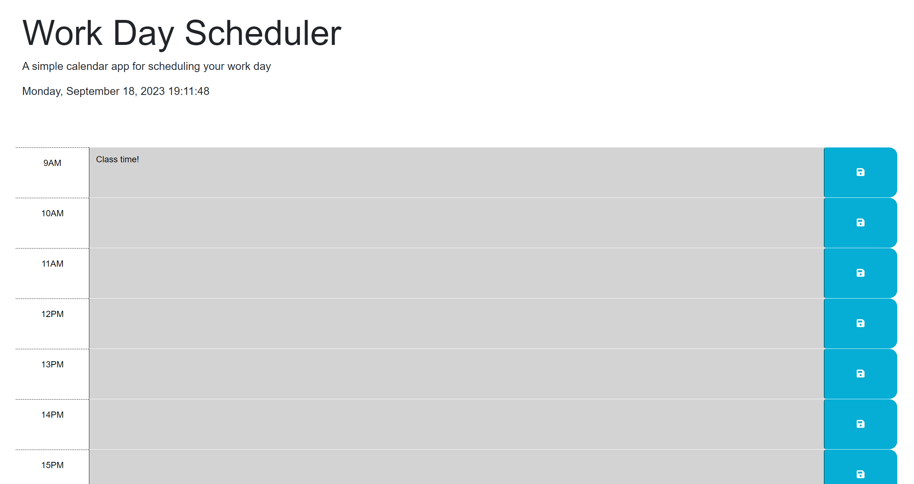

# Planner

## Description
This project focuses on creating a planner and being able to save each note on the designated time slot and to be able to reload the page and for that content to stay on the same time slot. The motivation behind this is to give the users the chance to create their daily tasks and to be able to come back to them even if they exit out of the website. I learned throughout this exercise the use of Jquery and DayJS to calculate the time and to color each time slot appropriately.

## Installation
https://github.com/Ericlee1783/Planner 

## Usage
 
All of the times right now are grayed out but once the current time or a future time is shown, the time slots will change accordingly. The present time slot will be reflected in red and the future time slot will be reflected in green. 
